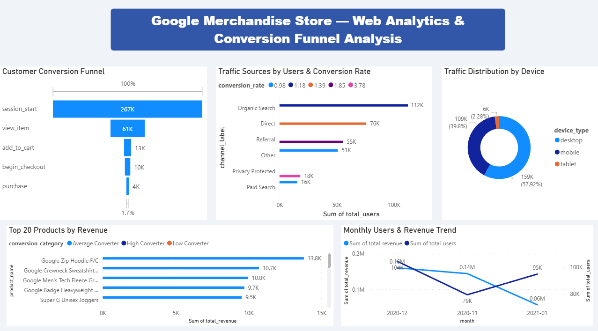

# Web Analytics & Conversion Funnel Analysis
## Overview
Analysis of real e-commerce data from the Google Merchandise Store using BigQuery, MySQL and Power BI.
The project investigates a 1.6% overall conversion rate — only 4,419 out of 267,116 visitors completed a purchase — and identifies where customers drop off across the purchase funnel, which marketing channels drive the highest quality traffic, and which products generate the most revenue.

---

## Dashboard Preview
 -->

---
 
## Author
**Belén Micó Velarde**  
[LinkedIn](https://www.linkedin.com/in/belenmicov)
 
---
 
## Tools
- **BigQuery** → querying raw GA4 event-level data
- **MySQL** → data storage, transformation, and view creation
- **Power BI** → interactive dashboard and visualizations
---
 
## Dataset
- **Source:** [Google Analytics 4 Demo Account](https://support.google.com/analytics/answer/6367342) — Google Merchandise Store
- **BigQuery table:** `bigquery-public-data.ga4_obfuscated_sample_ecommerce`
- **Period:** November 2020 — January 2021
- **Key events:** session_start, view_item, add_to_cart, begin_checkout, purchase
---
 
## Project Structure
```
web-analytics-conversion-funnel/
│
├── README.md
├── google_analytics_queries.sql
├── google_analytics_dashboard.pbix
└── google_analytics_dashboard.pdf
```
 
---
 
## Data Pipeline
 
```
Google Analytics 4 Demo Account
            ↓
    BigQuery (SQL queries on raw event data)
            ↓
         CSV exports
            ↓
    MySQL (raw tables + clean views)
            ↓
      Power BI (dashboard)
```
 
---
 
## SQL Analysis Structure
 
**Phase 1 — BigQuery (raw event data)**
Five queries against the GA4 public dataset covering the full conversion funnel, traffic source performance, device breakdown, top products by revenue, and monthly trend analysis.
 
**Phase 2 — MySQL (transformation and views)**
Five clean views created on top of the imported tables, adding drop-off rates using the `LAG()` window function, human-readable channel labels using `CASE` statements, device traffic share, product conversion categories, and month-over-month revenue growth.
 
---
 
## Power BI Dashboard Structure
 
KPI area → Total Users · Total Purchasers · Overall Conversion Rate · Total Revenue

Core Findings → Conversion Funnel · Traffic Sources by Channel · Device Breakdown

Supporting Insights → Top 20 Products by Revenue · Monthly Users & Revenue Trend
 
---
 
## Data Quality Issues Identified
 
Two anomalies were detected in the product data and excluded from revenue analysis:
 
**1. Super G Unisex Joggers — 104,254 units sold**
Significantly higher than any other product in the dataset. Likely a bulk order or recording error.
 
**2. Google Utility BackPack — 2,343,436,674 units sold**
Clearly a data error. Filtered out using `WHERE total_units_sold < 1,000,000` in the products view.
 
---
 
## Key Findings
 
- **Overall conversion rate: 1.6%** — 4,419 out of 267,116 visitors completed a purchase.
- **The biggest funnel drop happens at the very top.** 77.1% of visitors never viewed a single product, suggesting a homepage navigation or traffic quality issue rather than a checkout problem.
- **Cart abandonment is the second major leak.** 54.5% of users who started checkout never completed it — a classic e-commerce problem addressable through UX improvements or retargeting campaigns.
- **Paid Search (CPC) has the lowest conversion rate at 0.98%**, despite requiring budget investment. Referral traffic converts at 1.85% — nearly double — with no ad spend required.
- **Mobile converts at the same rate as desktop (1.70% vs 1.60%).** Contrary to typical industry benchmarks where mobile underperforms significantly, all devices show comparable conversion rates.
- **High converting products:** Google Campus Bike (4.83%), Google Canteen Bottle Black (4.71%), and Google Black Cloud Zip Hoodie (4.59%) show the strongest view-to-purchase rates.
- **January revenue dropped 64% vs December** ($57,350 vs $160,555) despite only a 9% drop in traffic — a classic post-holiday pattern where visitors return but purchasing intent is low.
---
 
## Business Recommendations
 
- **Improve homepage to product navigation.** 77% of visitors never see a product. Better featured products, clearer calls to action, or improved search could significantly increase funnel entry.
- **Review paid search ROI.** CPC traffic converts at the lowest rate of all channels. A campaign audit is recommended to assess whether the ad spend is justified.
- **Reduce checkout abandonment.** More than half of users who start checkout don't finish. Simplified checkout flow, trust signals, or cart abandonment emails could recover significant revenue.
- **Invest in referral partnerships.** Referral traffic converts better than any other trackable channel. Expanding affiliate or partnership programs could drive higher quality traffic at lower cost.
- **Plan for January seasonality.** Traffic stays stable after the holidays but purchasing intent drops sharply. A targeted January promotion could help maintain revenue momentum.
---
 
## Notes
This project uses the publicly available GA4 obfuscated sample dataset provided by Google for learning and portfolio purposes. The analytical framework, SQL structure, and dashboard design reflect the approach that would be applied to a real e-commerce dataset to identify conversion bottlenecks and inform marketing strategy.
 
